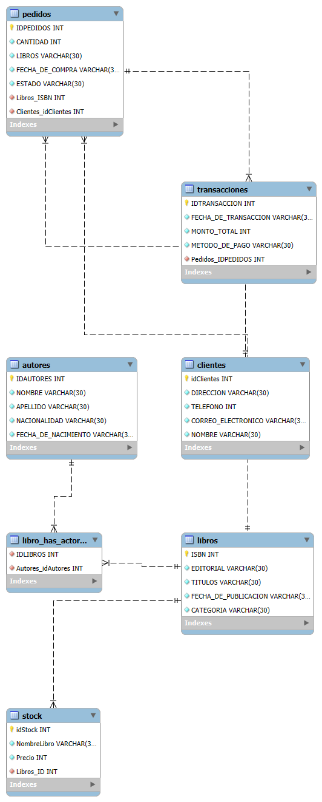
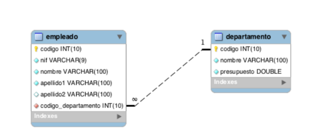

# MySQL
| Column 1 | Column 2 |
|----------|----------|
| Day 1    | My firs Script on Sql   |
| Day 2    |   --- |
| Day 3    | Jardinera data base, consults and inserts   |
| Day 4    | How to use Joins, left and right        |
| Day 5    | Universidad data base, consults and inser with joins      |
| Day 6    | Universidad data base, complex problems and socialization       |
| Day 7    | Functions and 63 consults optimized for function and joins        |

## Day 1

### Fisic Model


### Script SQL
```sql
CREATE database FiltroBSDD;

Use FiltroBSDD;

CREATE TABLE Libros (ISBN INT auto_increment NOT NULL, EDITORIAL VARCHAR(30) NOT
NULL,TITULOS VARCHAR(30) NOT NULL, FECHA_DE_PUBLICACION VARCHAR(30) NOT NULL,
CATEGORIA VARCHAR(30) NOT NULL,
PRIMARY KEY(ISBN)
);

CREATE TABLE Autores (IDAUTORES INT auto_increment NOT NULL, NOMBRE VARCHAR(30) NOT
NULL, APELLIDO VARCHAR(30) NOT NULL, NACIONALIDAD VARCHAR(30) NOT NULL,
FECHA_DE_NACIMIENTO VARCHAR(30) NOT NULL,
PRIMARY KEY(IDAUTORES)
);

CREATE TABLE Clientes(idClientes INT auto_increment NOT NULL, DIRECCION VARCHAR(30)
NOT NULL, TELEFONO INT NOT NULL, CORREO_ELECTRONICO VARCHAR(30) NOT NULL, NOMBRE
VARCHAR(30) NOT NULL,
PRIMARY KEY(IdClientes)
);

CREATE TABLE Pedidos(IDPEDIDOS INT auto_increment NOT NULL, CANTIDAD INT NOT NULL,
LIBROS VARCHAR(30) NOT NULL, FECHA_DE_COMPRA VARCHAR(30) NOT NULL, ESTADO
VARCHAR(30) NOT NULL, Libros_ISBN INT NOT NULL, Clientes_idClientes INT
NOT NULL,
PRIMARY KEY(IDPEDIDOS),
constraint Clientes_idClientes foreign key (Clientes_idClientes)
	references Clientes (IdClientes),
constraint Libros_ISBN foreign key (Libros_ISBN)
	references Libros (ISBN)
);

CREATE TABLE Transacciones(IDTRANSACCION INT auto_increment NOT NULL,
FECHA_DE_TRANSACCION VARCHAR(30) NOT NULL, MONTO_TOTAL INT NOT NULL, METODO_DE_PAGO
VARCHAR(30) NOT NULL, Pedidos_IDPEDIDOS INT NOT NULL,
PRIMARY KEY(IDTRANSACCION),
constraint Pedidos_IDPEDIDOS foreign key (Pedidos_IDPEDIDOS)
	references Pedidos (IDPEDIDOS)
);

CREATE TABLE Stock (idStock INT auto_increment NOT NULL, NombreLibro VARCHAR(30) NOT
NULL, Precio INT NOT NULL, Libros_ID INT NOT NULL,
PRIMARY KEY(idStock),
constraint Libros_ID foreign key (Libros_ID)
	references Libros (ISBN)
);

CREATE TABLE Libro_has_Actores(IDLIBROS INT NOT NULL, Autores_idAutores INT NOT
NULL,
constraint IDLIBROS foreign key (IDLIBROS)
	references Libros (ISBN),
constraint Autores_idAutores foreign key (Autores_idAutores)
	references Autores (IDAUTORES)
);
```

## Day 7
In this MySQL project we use the different ways to solve the following problems

### Consults 
Have 63 consults for a simple database:

#### Fisic Model


#### Script SQL
```sql
-- Lista el primer apellido de todos los empleados.
select apellido1 from empleado;

-- Lista el primer apellido de los empleados eliminando los apellidos que estén repetidos.
select distinct apellido1 from empleado;

-- Lista todas las columnas de la tabla empleado.
select * from empleado;

-- Lista el nombre y los apellidos de todos los empleados.
select nombre, apellido1, apellido2 from empleado;

-- Lista el identificador de los departamentos de los empleados que aparecen en la tabla empleado.
select id_departamento from empleado;

-- Lista el identificador de los departamentos de los empleados que aparecen en la tabla empleado, eliminando los identificadores que aparecen repetidos.
select distinct id_departamento from empleado;

-- Lista el nombre y apellidos de los empleados en una única columna.
select concat_ws("",nombre, " ", apellido1, " ", apellido2) as NombreCompleto from empleado;

-- Lista el nombre y apellidos de los empleados en una única columna, convirtiendo todos los caracteres en mayúscula.
select upper(concat_ws("",nombre, " ", apellido1, " ", apellido2)) as NombreCompleto from empleado;

-- Lista el nombre y apellidos de los empleados en una única columna, convirtiendo todos los caracteres en minúscula.
select lower(concat_ws("",nombre, " ", apellido1, " ", apellido2)) as NombreCompleto from empleado;

-- Lista el identificador de los empleados junto al nif, pero el nif deberá aparecer en dos columnas, una mostrará únicamente los dígitos del nif y la otra la letra.
SELECT REGEXP_REPLACE(nif,'[A-Z]','') as 'Numeros',REGEXP_REPLACE(nif,'[0-9]','') as 'Letras' from empleado;

-- Lista el nombre de cada departamento y el valor del presupuesto actual del que dispone. Para calcular este dato tendrá que restar al valor del
-- presupuesto inicial (columna presupuesto) los gastos que se han generado (columna gastos). Tenga en cuenta que en algunos casos pueden existir
-- valores negativos. Utilice un alias apropiado para la nueva columna columna que está calculando.

DELIMITER //
Create function PresupuestoActual (Id_departamento INT)
returns int
deterministic
begin
	declare Actual int;
    select presupuesto - gastos into Actual from Departamento where Id_departamento = id; -- AVERAGE
    return Actual;
end //
DELIMITER ;

select PresupuestoActual(2);

-- Lista el nombre de los departamentos y el valor del presupuesto actual ordenado de forma ascendente.
select presupuesto - gastos, nombre from Departamento order by 1 desc;

-- Lista el nombre de todos los departamentos ordenados de forma ascendente.
select nombre from departamento order by 1 asc;

-- Lista el nombre de todos los departamentos ordenados de forma descendente.
select nombre from departamento order by 1 desc;

-- Lista los apellidos y el nombre de todos los empleados, ordenados de forma alfabética tendiendo en cuenta en primer lugar sus apellidos y luego su nombre.
select apellido1, apellido2, nombre from empleado order by 1,2,3 asc;

-- Devuelve una lista con el nombre y el presupuesto, de los 3 departamentos que tienen mayor presupuesto.
select presupuesto, nombre from Departamento order by 1 desc limit 3;

-- Devuelve una lista con el nombre y el presupuesto, de los 3 departamentos que tienen menor presupuesto.
select presupuesto, nombre from departamento order by 1 asc limit 3;

-- Devuelve una lista con el nombre y el gasto, de los 2 departamentos que tienen menor gasto.
select gastos, nombre from departamento order by 1 asc limit 2;

-- Devuelve una lista con 5 filas a partir de la tercera fila de la tabla empleado. La tercera fila se debe incluir en la respuesta. La respuesta debe incluir todas las columnas de la tabla empleado.
select * from empleado limit 5 offset 2;

-- Devuelve una lista con el nombre de los departamentos y el presupuesto, de aquellos que tienen un presupuesto mayor o igual a 150000 euros.
select * from departamento where presupuesto > 150000;

-- Devuelve una lista con el nombre de los departamentos y el gasto, de aquellos que tienen menos de 5000 euros de gastos.
select * from departamento where gastos < 5000;

-- Devuelve una lista con el nombre de los departamentos y el presupuesto, de aquellos que tienen un presupuesto entre 100000 y 200000 euros. Sin utilizar el operador BETWEEN.
select * from departamento where presupuesto > 100000 and presupuesto < 200000;

-- Devuelve una lista con el nombre de los departamentos que no tienen un presupuesto entre 100000 y 200000 euros. Sin utilizar el operador BETWEEN.
select * from departamento where not presupuesto > 100000 and presupuesto < 200000;

-- Devuelve una lista con el nombre de los departamentos que tienen un presupuesto entre 100000 y 200000 euros. Utilizando el operador BETWEEN.
select * from departamento where presupuesto between 100000 and 200000;

-- Devuelve una lista con el nombre de los departamentos que no tienen un presupuesto entre 100000 y 200000 euros. Utilizando el operador BETWEEN.
select * from departamento where not presupuesto between 100000 and 200000;

-- Devuelve una lista con el nombre de los departamentos, gastos y presupuesto, de aquellos departamentos donde los gastos sean mayores que el presupuesto del que disponen.
select * from departamento where gastos > presupuesto;

-- Devuelve una lista con el nombre de los departamentos, gastos y presupuesto, de aquellos departamentos donde los gastos sean menores que el presupuesto del que disponen.
select * from departamento where gastos < presupuesto;

-- Devuelve una lista con el nombre de los departamentos, gastos y presupuesto, de aquellos departamentos donde los gastos sean iguales al presupuesto del que disponen.
select * from departamento where gastos = presupuesto;

-- Lista todos los datos de los empleados cuyo segundo apellido sea NULL.
select * from empleado where apellido2 is null;

-- Lista todos los datos de los empleados cuyo segundo apellido no sea NULL.
select * from empleado where apellido2 is not null;

-- Lista todos los datos de los empleados cuyo segundo apellido sea López.
select * from empleado where apellido2 = "López";

-- Lista todos los datos de los empleados cuyo segundo apellido sea Díaz o Moreno. Sin utilizar el operador IN.
select * from empleado where apellido2 = "López" or apellido2 = "Díaz";

-- Lista todos los datos de los empleados cuyo segundo apellido sea Díaz o Moreno. Utilizando el operador IN.
select * from empleado where apellido2 in ("López", "Díaz");

-- Lista los nombres, apellidos y nif de los empleados que trabajan en el departamento 3.
select nombre, apellido1, apellido2, nif from empleado where id_departamento = 3;

-- Lista los nombres, apellidos y nif de los empleados que trabajan en los departamentos 2, 4 o 5.
select nombre, apellido1, apellido2, nif from empleado where id_departamento = 2 or id_departamento=4 or id_departamento=5;

-- Devuelve un listado con los empleados y los datos de los departamentos donde trabaja cada uno.
select * from empleado inner join departamento on empleado.id_departamento = departamento.id;

-- Devuelve un listado con los empleados y los datos de los departamentos donde trabaja cada uno. Ordena el resultado, en primer lugar por el nombre
-- del departamento (en orden alfabético) y en segundo lugar por los apellidos y el nombre de los empleados.
select * from empleado inner join departamento on empleado.id_departamento = departamento.id order by departamento.nombre, empleado.nombre, empleado.apellido1 asc;

-- Devuelve un listado con el identificador y el nombre del departamento, solamente de aquellos departamentos que tienen empleados.
select departamento.id, departamento.nombre from departamento inner join empleado on departamento.id = empleado.id_departamento;

-- Devuelve un listado con el identificador, el nombre del departamento y el valor del presupuesto actual del que dispone, solamente de aquellos departamentos que tienen empleados. El valor del presupuesto actual lo
-- puede calcular restando al valor del presupuesto inicial (columna presupuesto) el valor de los gastos que ha generado (columna gastos).
select departamento.presupuesto - departamento.gastos as PresupuestoActual, departamento.id, departamento.nombre from departamento inner join empleado on departamento.id = empleado.id_departamento;

-- Devuelve el nombre del departamento donde trabaja el empleado que tiene el nif 38382980M.
select departamento.nombre from departamento inner join empleado on departamento.id = empleado.id_departamento where empleado.nif = "38382980M";

-- Devuelve el nombre del departamento donde trabaja el empleado Pepe Ruiz Santana.
select departamento.nombre from departamento inner join empleado on departamento.id = empleado.id_departamento where empleado.nombre = "Pepe" and empleado.apellido1= "Ruiz" and empleado.apellido2 = "Santana";

-- Devuelve un listado con los datos de los empleados que trabajan en el departamento de I+D. Ordena el resultado alfabéticamente.
select * from empleado inner join departamento on empleado.id_departamento = departamento.id where departamento.nombre = "I+D" order by empleado.nombre asc;

-- Devuelve un listado con los datos de los empleados que trabajan en el departamento de Sistemas, Contabilidad o I+D. Ordena el resultado alfabéticamente.
select * from empleado inner join departamento on empleado.id_departamento = departamento.id where departamento.nombre = "I+D" or departamento.nombre = "Sistemas" or departamento.nombre = "Contabilidad" order by empleado.nombre asc;

-- Devuelve una lista con el nombre de los empleados que tienen los departamentos que no tienen un presupuesto entre 100000 y 200000 euros.
select empleado.* from empleado inner join departamento on empleado.id_departamento = departamento.id where not presupuesto between 100000 and 200000;

-- Devuelve un listado con el nombre de los departamentos donde existe algún empleado cuyo segundo apellido sea NULL. Tenga en cuenta que no debe mostrar nombres de departamentos que estén repetidos.
select departamento.nombre from departamento inner join empleado on departamento.id = empleado.id_departamento where empleado.apellido2 is null;

-- Devuelve un listado con todos los empleados junto con los datos de los departamentos donde trabajan. Este listado también debe incluir los empleados que no tienen ningún departamento asociado.
select empleado.*,departamento.nombre from empleado left join departamento on empleado.id_departamento = departamento.id;

-- Devuelve un listado donde sólo aparezcan aquellos empleados que no tienen ningún departamento asociado.
select * from empleado where id_departamento is null;

-- Devuelve un listado donde sólo aparezcan aquellos departamentos que no tienen ningún empleado asociado.
select departamento.* from departamento left join empleado on departamento.id = empleado.id_departamento where empleado.id_departamento is null;

-- Devuelve un listado con todos los empleados junto con los datos de los departamentos donde trabajan. El listado debe incluir los empleados que no
-- tienen ningún departamento asociado y los departamentos que no tienen ningún empleado asociado. Ordene el listado alfabéticamente por el nombre del departamento.
select * from empleado right join departamento on departamento.id = empleado.id_departamento where empleado.id_departamento is null
union
select * from empleado left join departamento on departamento.id = empleado.id_departamento where empleado.id_departamento;

-- Devuelve un listado con los empleados que no tienen ningún departamento asociado y los departamentos que no tienen ningún empleado asociado.
-- Ordene el listado alfabéticamente por el nombre del departamento.
select * from empleado left join departamento on departamento.id = empleado.id_departamento where empleado.id_departamento is null
union
select * from empleado right join departamento on departamento.id = empleado.id_departamento where empleado.id_departamento is null;

-- Calcula la suma del presupuesto de todos los departamentos.
select sum(presupuesto) as PresupuestoTotal from departamento;

-- Calcula la media del presupuesto de todos los departamentos.
select avg(presupuesto) as Media from departamento;

-- Calcula el valor mínimo del presupuesto de todos los departamentos.
select  min(presupuesto) from departamento;

-- Calcula el nombre del departamento y el presupuesto que tiene asignado, del departamento con menor presupuesto.
select nombre, min(presupuesto) from departamento group by 1 order by 2 limit 1;

-- Calcula el valor máximo del presupuesto de todos los departamentos.
select max(presupuesto) from departamento;

--  Calcula el nombre del departamento y el presupuesto que tiene asignado, del departamento con mayor presupuesto.
select nombre, max(presupuesto) from departamento group by 1 order by 2 desc limit 1;

-- Calcula el número total de empleados que hay en la tabla empleado.
select count(nombre) from empleado;

-- Calcula el número de empleados que no tienen NULL en su segundo apellido.
select count(nombre) from empleado where apellido2 is not null;

-- Calcula el número de empleados que hay en cada departamento. Tienes que devolver dos columnas, una con el nombre del departamento y otra con el
-- número de empleados que tiene asignados.
select departamento.nombre, count(empleado.nombre) from empleado left join departamento on empleado.id_departamento = departamento.id group by 1;

-- Calcula el nombre de los departamentos que tienen más de 2 empleados. El resultado debe tener dos columnas, una con el nombre del departamento y
-- otra con el número de empleados que tiene asignados.
select departamento.nombre, count(empleado.nombre) from empleado right join departamento on empleado.id_departamento = departamento.id group by 1 having count(empleado.nombre) >2;

-- Calcula el número de empleados que trabajan en cada uno de los departamentos. El resultado de esta consulta también tiene que incluir
-- aquellos departamentos que no tienen ningún empleado asociado.
select departamento.nombre, count(empleado.nombre) from empleado right join departamento on empleado.id_departamento = departamento.id group by 1;

-- Calcula el número de empleados que trabajan en cada unos de los departamentos que tienen un presupuesto mayor a 200000 euros.
select departamento.nombre, count(empleado.nombre) from empleado right join departamento on empleado.id_departamento = departamento.id where presupuesto > 200000 group by 1;

```